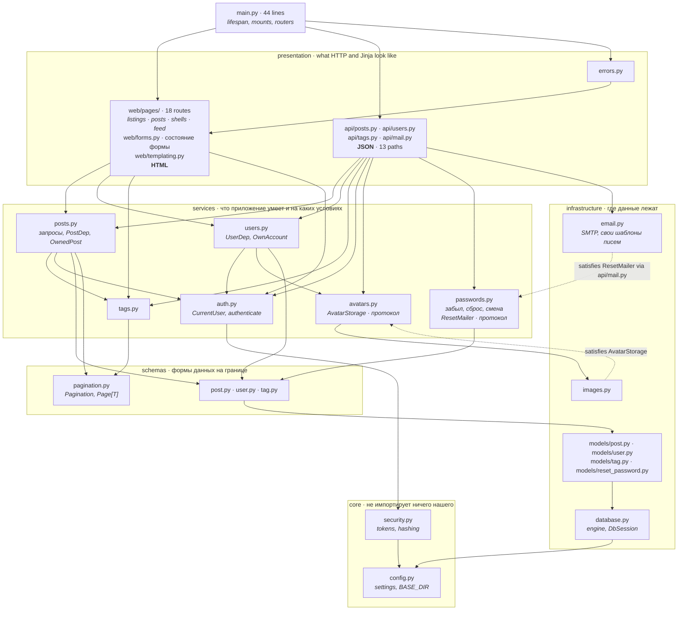
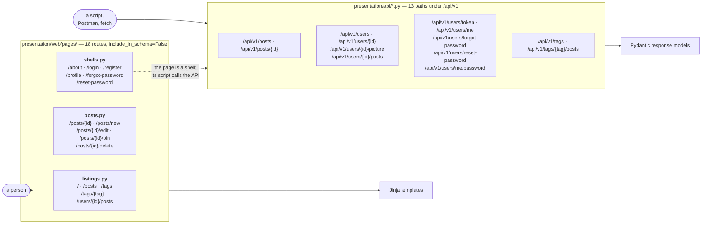
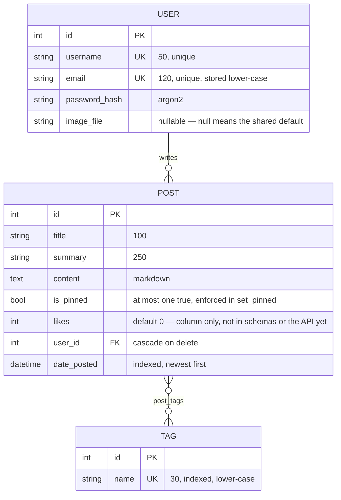
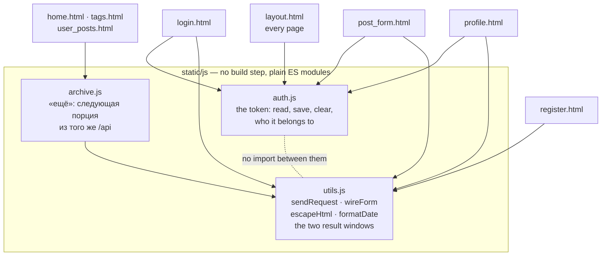

# The shape of this application

Four diagrams, each answering a question that costs time to re-derive by
reading: what may import what, which front door a request came in by, what
the data actually is, and what runs in the browser.

All of them were generated from the code rather than from memory — the import
graph by walking every module's AST, the API paths out of `/openapi.json`, the
page paths out of the decorators in `presentation/web/pages/`. If a diagram
here is wrong, the code moved.

For how a request is *authenticated*, see [auth.md](auth.md). For why the
pages have their own router, [adr-001-pages-and-api.md](adr-001-pages-and-api.md).

---

## What may import what

Five layers, each a package under `src/blog/`, one module per thing inside it.
Every arrow points down, and the diagram shows the edges that carry
information — not the ones every module has. Nearly everything above
`infrastructure` also imports `models` and `database` for the ORM classes and
the `DbSession` alias, and drawing that a dozen more times would have said only
that the layers exist.



**The rule this records:** arrows only ever point downwards, and the one place
it is easy to break is `presentation`. `web/` does not import `api/` — both ask
`services/` instead, which is why «пост не найден» is one place in the code
rather than two that drifted apart. Before the split it was not like that:
`pages` imported the JSON routers for their base query and their dependencies,
and every page inherited whatever the API happened to need.

A module below importing a router is the mistake that already happened once —
`schemas.py` imported the tags router for a tag-cleaning helper, and since that
router imported `schemas` back by way of the posts one, the application stopped
importing at all. The helper was pure data cleaning and belongs where it now
sits, in `schemas/tag.py`.

**Two arrows inside `services` worth explaining.** `posts.py` imports `tags.py`
because storing a post means creating the tags it names; `users.py` and
`posts.py` both import `auth.py` because ownership is a question about the
current user. Nothing points back: `tags.py` returns tags, never posts, and
what returns posts *by* tag lives in `posts.py`. Otherwise the two would
import each other. `users.py` imports `avatars.py` for one reason only —
deleting an account has to delete the file its picture is in.

**The two dotted arrows are the interesting ones.** They point up, and no
import does. Two services state what they need as a `Protocol` and are handed
something that matches:

| Protocol | Declared in | Satisfied by |
|---|---|---|
| `AvatarStorage` | `services/avatars.py` | `infrastructure/images.py` · `DiskAvatars` |
| `ResetMailer` | `services/passwords.py` | `presentation/api/mail.py` · `BackgroundMail` |

Neither implementation imports the protocol it satisfies, and neither has to:
`typing.Protocol` is structural, so matching the shape is the whole of the
requirement. An abstract base class would have needed inheritance, and
inheritance would have needed the import — `infrastructure` importing
`services`, an arrow pointing up, and a test failure. This is dependency
inversion done in the direction the layering already insists on: the policy
(«a picture is stored, then the old file goes») owns the interface, and the
mechanism (Pillow, a directory, SMTP) is what gets swapped.

Each protocol is also as narrow as its one caller needs. `AvatarStorage` has
`save` and `delete` and nothing else, though `images.py` could offer more; a
wider interface is a promise every future implementation has to keep in order
to serve code that never asks.

**And the arrow that used to point back.** Pagination arrived as `SkipDep` and
`LimitDep` living in `services/posts.py`, because posts were the first list to
need them. Tags are paged the same way, so `tags.py` imported `posts.py`, and
`posts.py` already imported `tags.py` — the application stopped importing.
A slice is not a property of either entity; it belongs at the boundary, which
is why `Pagination` and `Page[T]` sit in `schemas/pagination.py` and both
services read them from there. This is the same mistake as the tag-cleaning
helper above, one layer up.

**A third cycle, and the same shape.** Password reset arrived with
`models/user.py` importing `PasswordResetToken` at runtime while
`models/reset_password.py` imported `User` back — and the application
stopped starting. Both sides now name each other in annotations only, as
`tag.py` and `post.py` already did. The test caught it and printed the
edge; what it could not do was run, because the branch predated CI.

`seed.py` is off the diagram. It imports `core.security`, `infrastructure` and
`services.tags` and is imported by nothing; it is a script, not part of the
running application.

**This section is a test, not a description.** `tests/test_import_graph.py`
walks the same ASTs and fails on a cycle, on an arrow pointing up, and on a
sideways arrow that is not in its list with a reason attached. It exists
because the rule was broken twice — the tag-cleaning helper above, and later
the pagination slice — and both times the ImportError named the module that
happened to be first in the chain rather than the module that was wrong.
The test names the edge.

---

## Two front doors



**The version is in the path, not in the package.** Routers live in
`presentation/api/`, and `API_PREFIX = "/api/v1"` in that package's `__init__`
is the only line that knows the number. Splitting into `api/v1/` and `api/v2/`
is what to do when a second version actually starts — doing it now would build
a shape for something that may never arrive, and the prefix constant means the
move costs one import path per module when it does.

The dotted arrow is the thing to hold on to. **Sign-in, registration and the
profile render as empty shells and fill themselves from the API**, because the
token lives in `localStorage` and Jinja cannot see it. Every other page is
rendered whole by the server.

That is also why the pages are `include_in_schema=False`: `/openapi.json`
describes the thirteen API paths and nothing else, so the contract test in the
Postman collection compares like with like.

---

## The data



Three things the columns do not say:

- **`image_file` null is meaningful.** It means "no photo of their own", and
  `User.image_path` turns it into `/static/profile_pics/default.jpg`. Deleting
  a picture sets it back to null and removes the file.
- **`is_pinned` is a single-winner flag** with no constraint behind it.
  `set_pinned` in `services/posts.py` clears the others in the same
  transaction; nothing in the schema would stop two rows being true if
  something else wrote them.
- **Deleting a user cascades to their posts** and to their uploaded file.
  Tags are left behind even when nothing references them any more — they
  become invisible in `/api/v1/tags`, which counts through posts, but they do
  accumulate.

---

## What runs in the browser



`auth.js` and `utils.js` **do not know about each other**, and that is
deliberate: one is about identity, the other about talking to an API and
reporting the result. A page that needs both composes them; a page that needs
one carries one. `register.html` needs no token, so it never loads `auth.js`.

`layout.html` loads only `auth.js`, because the one thing every page decides
is which of *Sign in* / *Sign out* to show and whether to reveal controls
marked `data-author-only`.

---

## What is covered by what

| Layer | Tool | Count | What it can see |
|---|---|---|---|
| API contract | Postman / Newman | 101 requests, 375 assertions | Every documented path, every refusal, ownership |
| Live pages | Playwright | 3 journeys | What the scripts do with real answers |
| Pure JS functions | — | none yet | `currentUserId` parsing, error wording |
| Routes and templates | — | none yet | That a page renders at all |

```bash
./scripts/api-tests.sh   # throwaway database, throwaway server, no trace left
uv run pytest            # the three browser journeys
```

The two empty rows are the cheap ones, and they are empty because the
expensive layers were written first — the API tests because the API is the
contract, and the browser tests because a dialog that leaves the page
scroll-locked cannot be seen from anywhere else. `node --test` needs no
dependency at all for the first of them.

Both run in CI on every pull request (`.github/workflows/ci.yml`), alongside
ruff, djlint, pyrefly, a strict docs build and an Alembic-drift check. Running
them locally first is faster than waiting for the answer.
