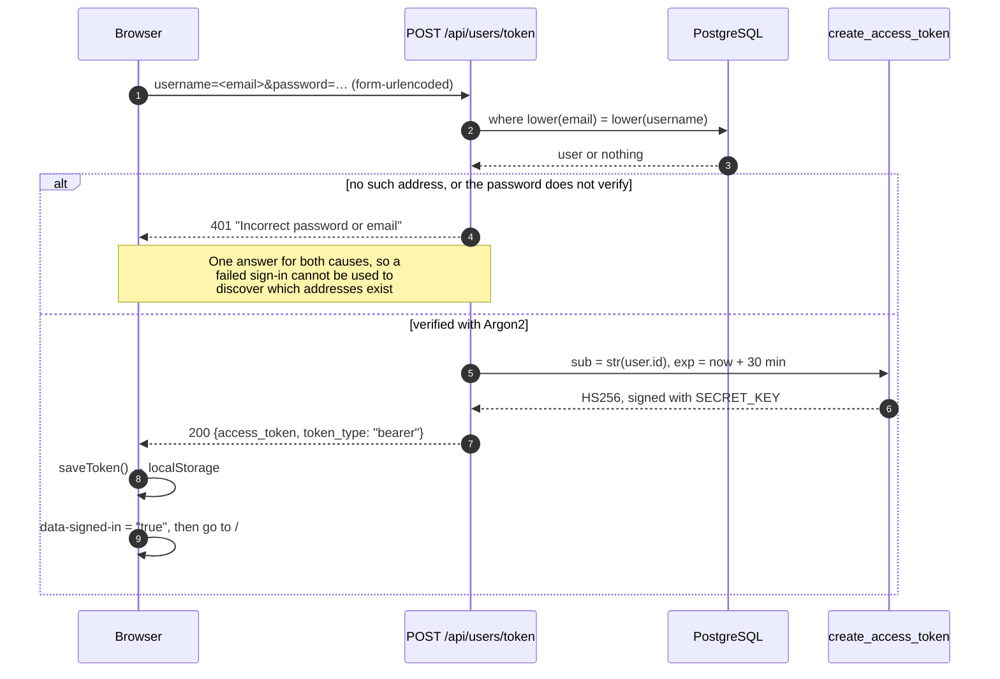
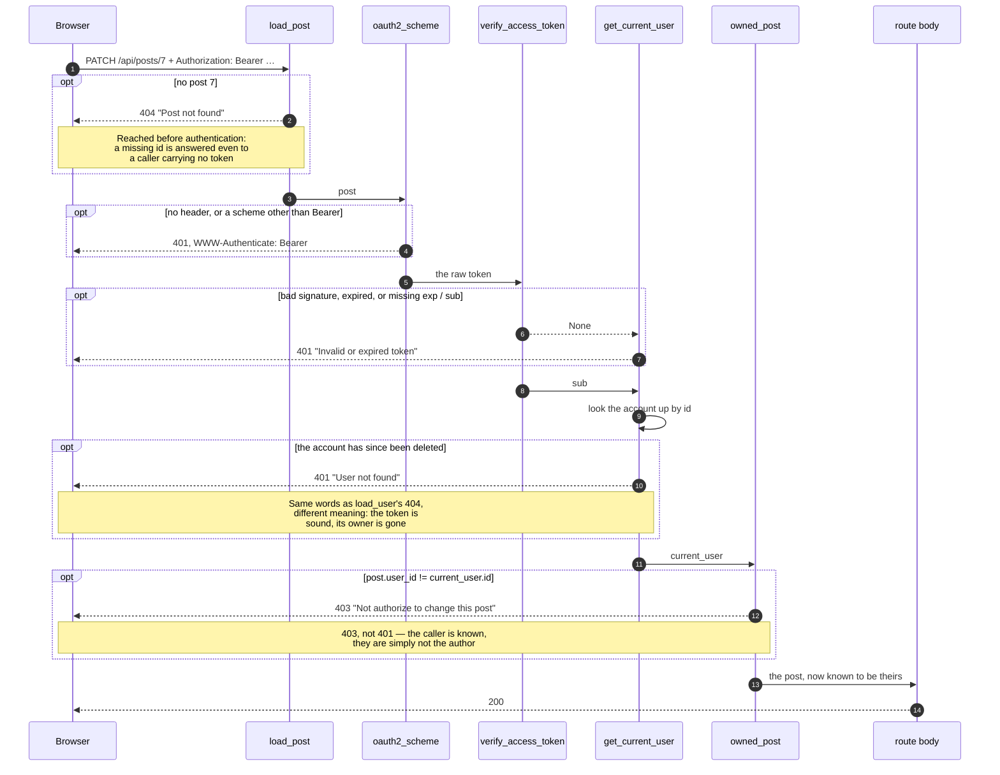
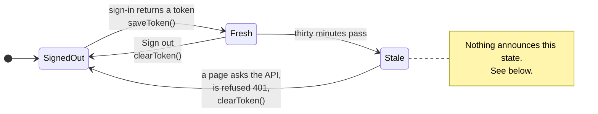

# How a request is authenticated and authorized

Two diagrams for the two questions the code asks in order — *who is
this* and *may they do it* — and one for where the token lives in
between.

Only these three. A diagram of an ordinary CRUD route would say less
than the route does and would rot the first time the route changed;
what is drawn here is the part that is genuinely hard to reconstruct by
reading, because it is about **order** — which refusal wins when more
than one applies.

---

## Signing in

`POST /api/users/token` is the only endpoint that takes a form body
rather than JSON: `OAuth2PasswordRequestForm` reads `username` and
`password` as form fields. The field is called `username` because OAuth2
says so; this API looks the account up by email, and the sign-in page
labels it honestly.



The token carries **only** `sub` and `exp`. No name, no role, no email —
so nothing in it goes stale, and nothing in it is worth reading except
to know who is asking.

---

## An authorized request

This is the diagram worth having. FastAPI resolves the dependencies in
the order the signature declares them, and each one can end the request,
so the order decides which refusal a caller sees when two apply at once.

```python
async def update_post_fields(post: OwnedPost, data: PostUpdate, db: DbSession)
```

`OwnedPost` is one name for the whole chain below.



### The precedence, in words

| Situation | Answer |
|---|---|
| post missing, no token | **404** — the id is resolved first |
| post exists, no token | **401** |
| post exists, token forged or expired | **401** |
| post exists, token sound, account deleted | **401** |
| post exists, valid token, someone else's post | **403** |
| everything in order | **200** |

Each row is asserted in `postman/`, because this table is the kind of
thing that changes by accident when a signature is reordered.

`services/users.py` has the same shape with `OwnAccount`, and its refusal
reads `"Not authorize to change profile"` — different wording for a
different resource, and both are pinned by tests so they cannot drift
into each other.

---

## Where the token lives in between

The token sits in `localStorage`, which the server cannot see. That is
the whole reason the pages have states at all: nothing in a Jinja
template can know whether you are signed in, so the browser decides
after the page has loaded.



`Stale` is the state worth knowing about, because nothing announces it
and two parts of the interface read it differently:

- `currentUserId()` decodes `exp` and already returns `null`, so the
  **Edit** control disappears at the right moment.
- the navigation only checks that a token is *present*, so it goes on
  offering **Sign out**.

Whichever page next asks the API settles it — the profile is the usual
one — and `clearToken()` puts both back in agreement. So a person who
leaves a tab open for an hour sees a menu that still claims they are
signed in, until they click something. That is not a bug so much as an
unavoidable consequence of the token being the only thing the browser
holds, but it is the sort of thing that reads as one in a report.

Moving the token into an httpOnly cookie removes this state entirely —
the server would decide, and `is_author` in `presentation/web/templating.py` could stop
being hardcoded. That is the intended direction, not yet taken.
